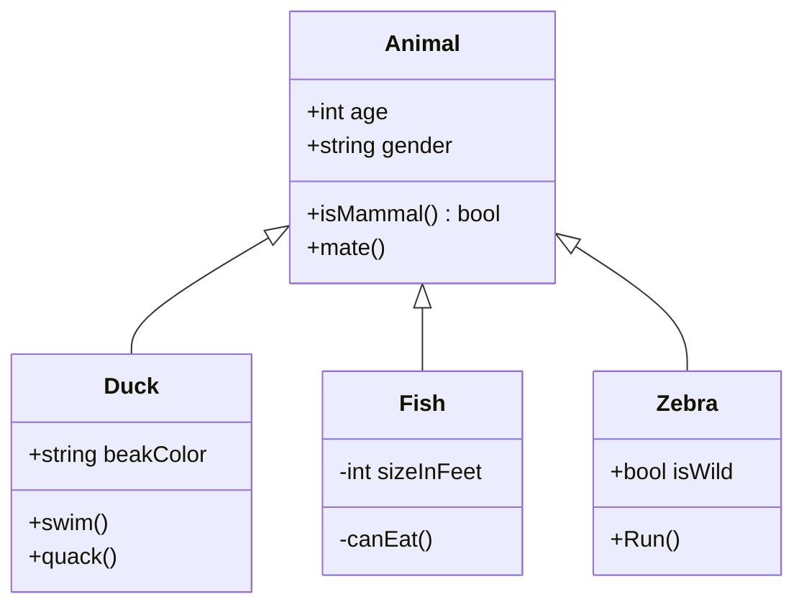
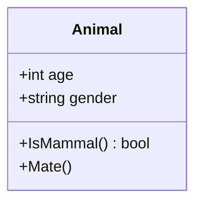

# 概述

[Unified Modeling Language (UML)](https://en.wikipedia.org/wiki/Unified_Modeling_Language) 是一组建模语言。程序开发中的许多模型关系可以用这些语言进行表述。UML 的众多语言中，最为常用的就是用于描述类和类关系的 Class Diagram，本教程就主要介绍 UML 的 Class Diamgram。

UML 本身只是一个语言规范，需要软件实现才能将 UML 文档转换成直观的图表。本教程中使用 [mermaid](https://mermaid-js.github.io/mermaid/#/classDiagram) 实现的 UML Class Diagram。由于 mermaid 只是一个 JavaScript 类库，难以直接使用。本文实际上是通过 [Visual Studio Code](https://code.visualstudio.com/) 及其插件 [Markdown Preview Mermaid Support](https://marketplace.visualstudio.com/items?itemName=bierner.markdown-mermaid) 间接使用 mermaid 渲染嵌入在 Markdown 中的 Class Diagram。本教程中的 Markdown 文档（后缀为`.md`）均可在安装了 Markdown Preview Mermaid Support 的 Visual Studio Code 中预览或编辑。

在 Markdown 文件中，使用以下格式可以嵌入 mermaid 代码块：

````
```mermaid
```
````

一个 mermaid 代码块会被当作一幅图像渲染。在代码块内第一行，需要首先标明 mermaid 图像类别，例如：

````
```mermaid
classDiagram
```
````

然后可以添加一些内容描述的代码，例如：

````

````

其中语句的意义我们会在后边逐渐讲解，它渲染之后的结果是：


如果想在 mermaid 代码中增加注释代码，可以以 `%%` 开头。如果一行的`%%`之前只有空白符，它仍然是注释。例如：

````

````

渲染后仍为：


mermaid 代码块中除了图表类型说明和注释以外的部分就是图表的内容描述。不难看出，这些内容大致分为两种单元。一类是定义节点的。例如：

````

````

定义了这个节点：


还有一类定义了节点之间的联线，例如之前代码中的这一行定义了 `Animal` 和 `Duck` 之间的连线。

```
Animal <|-- Duck
```
