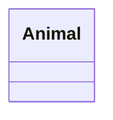
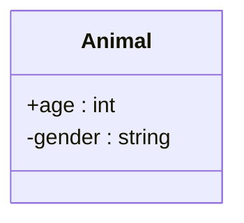
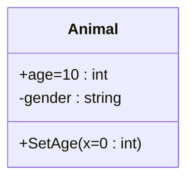

# 类节点

Class Diagram 图中节点以类节点为主。类节点由三个部分组成。其一是关键词 `class`，其二是类名，其三是花括号中的代码块。例如一个名为 `Animal` 的类可以表示为：

````

````

渲染后的结果是


在类的花括号里可以填写类成员，每一行为一条类成员。类成员分为属性和方法两种。两种成员的语法不同， mermaid 会自动整理把属性和方法分为两部分显示。

属性由四个必选部分组成。第一部分是访问控制符号。共有四种符号可选：

* `+` 表示 public 访问权限
* `-` 表示 private 访问权限
* `#` 表示 protected 访问权限
* `~` 表示 internal (package 内部) 访问权限

第二部分是属性名。第三部分是作为分隔符的冒号。第四部分则是冒号后的类型名。

一些典型的属性可以表示为：

````

````

渲染后为：


方法由四个必选部分组成。其一和属性一样是访问控制符。其二是方法名。其三是参数列表。参数列表要用括号括起来，其中不同的参数项由逗号分隔。第四个则是函数返回值类型。返回值类型写在参数列表之后，不需要冒号分隔，但是 mermaid 在渲染之后会给参数列表和返回值类型之间加冒号。

一个简单的无参数列表方法可以表示为：

```
+IsMammal() bool
```

没有返回值的方法则可以不标注返回值类型，例如：

```
+Eat(food : Food)
```

非空的输入参数列表中每一项又由三部分组成——变量名、冒号和类型——这和属性的标注方法类似。例如：

```
+Add(x : int, y : int) int
```

如果要为属性或者函数参数设置默认值，可以之间在变量名之后用 `=` 标识。

例如：

````

````

渲染为：


对于函数参数来说，还有一类可选的标识。

