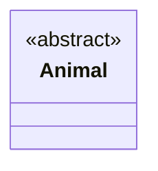
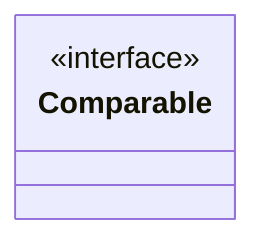
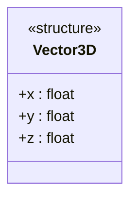

不过这个后边再做介绍。除了类属性，再花括号里还可以写类的类型标记。例如抽象类可以通过在花括号内第一行加 `<<abstract>>` 表示。一个抽象的 `Animal` 类可以记为：

````

````

渲染为：


接口类则可以通过加 `<<interface>>` 表示。例如：


（没有类型标记）

````

````

渲染为：


这些标记并不是通过语法规则定义的，完全可以安装需要扩展。例如结构体可以用 `<<structure>>` 表示。一个简单的三维向量结构体可以表示为（在这个例子中，结构体成员是仿照类成员的写法写的）：

````

````

渲染为：


