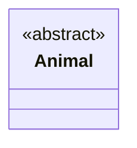
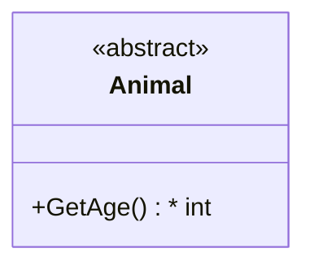
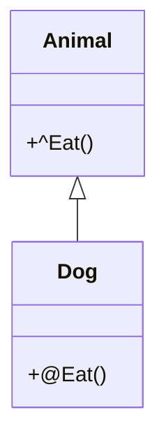
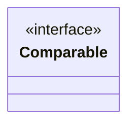
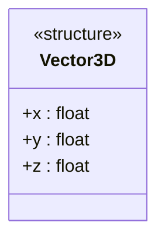

# 抽象类和接口

在一般的面向对象程序设计模式中，并非所有的类都是普通类。例如为了方便继承和重载，许多面向对象编程语言中会有抽象类、抽象方法和接口等语法。

抽象类在 mermaid 中没有专门的关键词，而是通过在普通类花括号内第一行加 `<<abstract>>` 表示。一个抽象的 `Animal` 类可以记为：

````

````

渲染为：


抽象方法则通过在函数参数列表括号后边加 `*` 来表示。 mermaid 可以将抽象方法自动渲染为斜体。例如：

````

````

渲染为：


遗憾的是，对同样影响基础与重载关系的关键词 `virtual` 和 `override`， mermaid 没有专门的语法规则。我们可以约定以 `^` 加在方法名前来表示方法是虚方法，用 `@` 加在方法名前表示重载方法。例如：



类之间的多重继承往往会导致方法实现的混乱。为了解决这个问题一些语言引入了接口机制。接口不是类，但可以被类继承，而且一个类可以继承多个接口。并且，接口的成员只有方法而没有属性。

接口的成员方法没有访问控制符，因为
必须是 `public` 且必须在继承了接口的子类中实现。


接口类则可以通过加 `<<interface>>` 表示。例如：


（没有类型标记）

````

````

渲染为：


这些标记并不是通过语法规则定义的，完全可以安装需要扩展。例如结构体可以用 `<<structure>>` 表示。一个简单的三维向量结构体可以表示为（在这个例子中，结构体成员是仿照类成员的写法写的）：

````

````

渲染为：


枚举