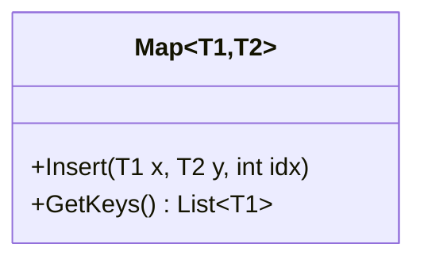
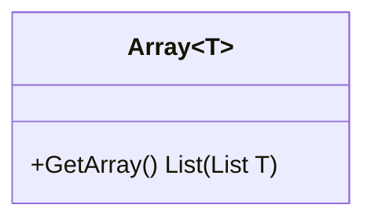
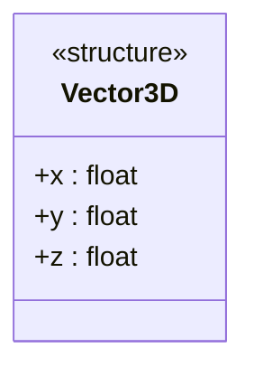
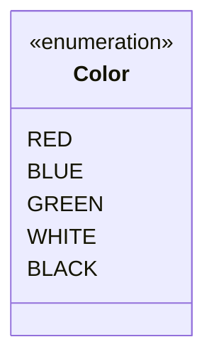

# 泛型和其他节点

为了压缩代码量，一些语言支持泛型。泛型在 UML Class Diagram 中的表示方法和大多数类 C 语言中的表示方法类似，都是在类名或者方法名后边加尖括号，括号内写泛型变量。只不过由于语法冲突， mermaid 不支持直接写 `<` 和 `>` 而是需要写 `~`。在渲染时一对 `~` 会自动渲染为尖括号例如：

````markdown

````

渲染为：


不过遗憾的是 mermaid 中不支持泛型的嵌套，所以其表达能力多少还是受限制的。所以我建议必要时采用类 Haskell 的方法表示带参数类型例如

```markdown
List<List<int>>
```

不妨写作

```markdown
List (List int)
```

具体看一下这个例子：

````markdown

````

渲染为：


有的语言中除了类，还支持定义结构体，枚举等类型。可以通过用类定义语法加标注的方式来表示这些节点。例如结构体可以用 `<<structure>>` 表示。一个简单的三维向量结构体可以表示为（在这个例子中，结构体成员是仿照类成员的写法写的）：

````markdown

````

渲染为：


还有枚举，可以用 `<<enumeration>>` 表示，其成员不需要类型标记也不需要访问控制修饰。例如：

````markdown

````

渲染为：


