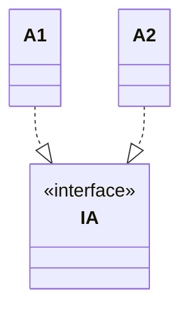

# 继承和实现关系

节点之间的关系通过联线表示。一条联线就由一个联线描述语句表示。一个联线描述语句独占一行，一般包括一个箭头符号和表示箭头始终的类名。例如 `--|>` 可以表示在前的类继承自在后的类（`<|--` 表示在后的类继承自在前的类）。

这是一个 `B` 类和类 `C` 继承了 `A` 类的例子（箭头指向的地方是父类）：

````markdown

````

渲染为：


如果要表示类实现了接口，则用 `..|>`，在前的是类名，在后的是接口名（箭头指向被实现的接口）。

例如：

````markdown

````

渲染为：


这两种关系是和代码实现息息相关的。除此而外 UML Class Diagram 还能表示一些其他的语义或者语法关系，这些关系虽然描述不如这两种关系确凿但是也可以提供很多有意义的信息。这些内容在下一节进行介绍。
