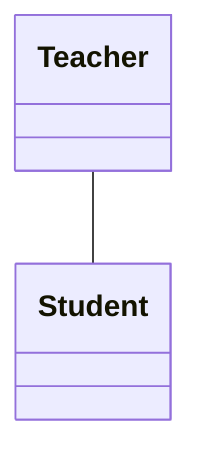
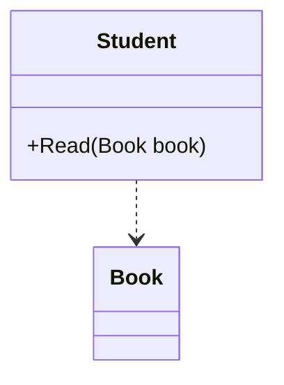
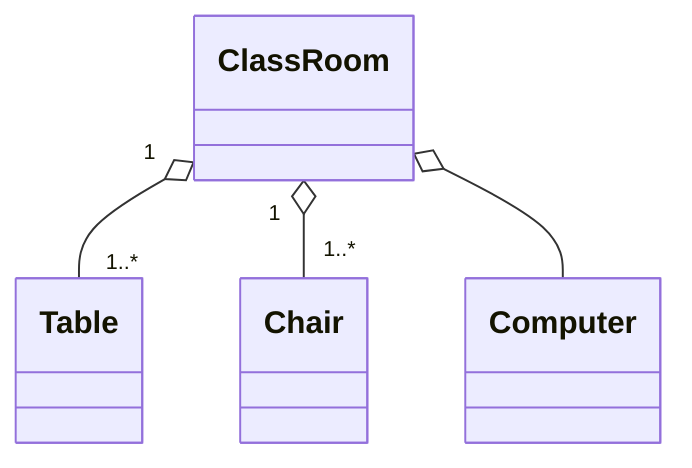
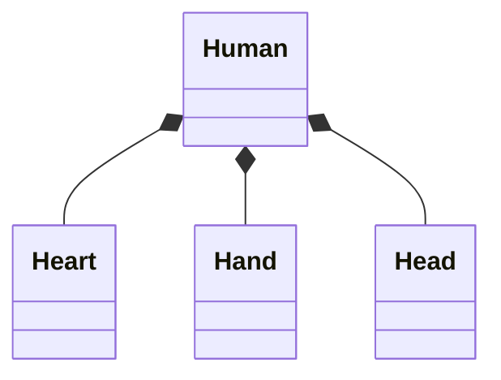
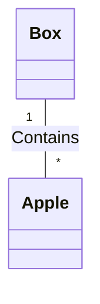

# 节点间相关关系

如果两个类之间仅仅是有相关关系，没有继承关系，那么可以使用 `--` 联接。例如：

````

````

渲染为：


如果想进一步说明关系的类型还有一些别的联线可以选。例如类 `A` 的方法中用到了类 `B` 的实例作为参数，就说类 `A` 依赖类 `B`，用 `A ..> B` 表示。

例如：

````

````

渲染为：


如果类 `A` 可以由类 `B`， `C`， `D` 等组合而成，则可用聚合关系表示。其符号为 `o--`。其中 `o` 一端指向总体 `A`， `--` 一端指向表示部分的 `B`， `C`， `D`。例如一个教室的组成可以这样表示：

````

````

渲染为：


在表示关系的符号两端还可以用字符串作标记。常用的数量标记有：

* `1` 只有一个
* `0..1` 没有或只有一个
* `1..*` 一个或更多
* `*` 任意个
* `n` n 个（`n`应当是一个具体的数字而非字母“n”）
* `0..n` 零到 n 个
* `1..n` 一到 n 个

一个关系符号的两端都可以加这种说明。例如一个教室可以包含多个桌子和椅子可以这样表示：

````

````

渲染为：


组合关系类似聚合关系，但是它比聚合关系更强。如果聚合关系中的一个组件缺失了不会对总体造成损害，但是如果组合关系中的部件缺失就会对总体造成损害。组合关系使用 `*--` 表示， `*` 一端指向总体。例如：

````

````

渲染为：


最后所有的关系描述都可以后加冒号然后加文字说明。例如：

````

````

渲染为：


